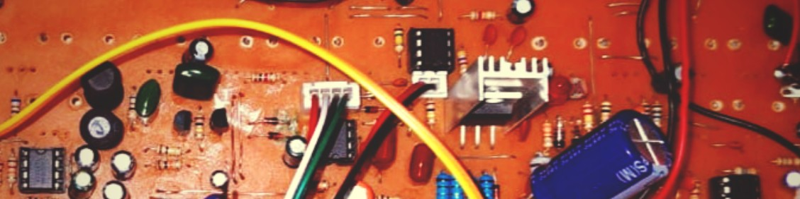

<!---->

- 👋 Hi, I’m @yasith46
- 👀 I’m interested in Machine Learning, Embedded Systems, IoT and Robotics
- 🌱 I’m currently learning Electronic and Telecommunications Engineering at University of Moratuwa, Sri Lanka
- 💞️ I’m looking to collaborate on Embedded Systems and IoT related projects
- 📫 How to reach me: Shoot me an email at yasithudana3@gmail.com or send me a Twitter DM at [@heyimyudi](https://twitter.com/heyimyudi)
- 😄 Pronouns: He/Him
- ⚡ Fun fact: My laptop is dusty, you might wonder if I live in Sahara but no they'd have a cleaner one

<!---
yasith46/yasith46 is a ✨ special ✨ repository because its `README.md` (this file) appears on your GitHub profile.
You can click the Preview link to take a look at your changes.
--->
